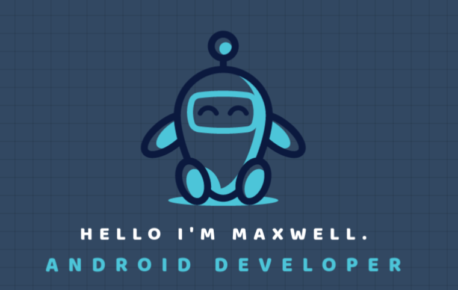

[ width=500px height=200px](https://github.com/bezmaxwell)

- 👀 Android Developer position remote. Seeking for remote job: EU,UK,Europe.
- 🎓 Graduation Computer Science from Estácio 2024
- 🌱 I’m currently ,learning android patterns,new features in android
- 🛠  I’m working on  [Rent Car - Rent Car control](https://github.com/bezmaxwell/rentcar)
- 📫 Find me on [LinkedIn]([https://www.linkedin.com/in/bezmaxwell/](https://www.linkedin.com/in/maxwell-chaves-68654b1a0/)

## Skills

#### Languages

    
     
    
    
    

 
 #### Frontend / Backend
 

  
  
  
  

#### Databases

  
  

 
#### Tools

  
  
  
  
  
    

## Stats

